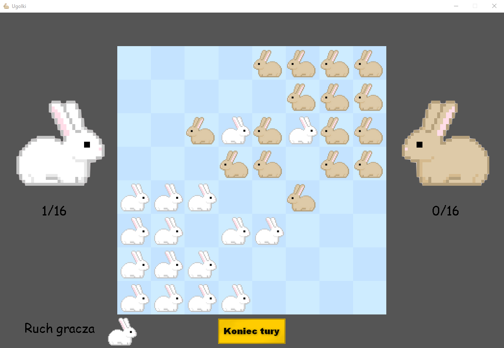

# Ugolki

Celem projektu jest zaimplementowanie gry dwuosobowej Ugolki oraz algorytmu min-max z usprawnieniami (cięciami α-β). Algorytm operuje na węzłach drzewa, które 
przechowywują kolejne możliwe stany rozgrywki.
Rozgrywka odbywa się na planszy 8x8, a każdy z graczy rozpoczyna partię z 16 pionkami
ułożonymi w kwadrat 4x4 po przeciwległych rogach planszy. Celem gry jest jak 
przemieszczenie swoich pionków na miejsca w których znajdowały się pionki przeciwnika 
przy rozpoczęciu rozgrywki. W tym celu pionki mogą poruszać się o jedno pole w kierunku 
góra/dół lub prawo/lewo albo ‘przeskakiwać’ nad pojedynczymi pionkami w analogiczne 
strony. Wygrywa gracz, któremu uda się umieścić swoje pionki na właściwym miejscu nim 
zrobi to przeciwnik.

Dostępne są 3 tryby gry:
* gracz vs komputer
* gracz vs gracz
* komputer vs komputer

## Wymagania

Do uruchomienia projektu wymagany jest Python 3.9 oraz zainstalowanie bibliotek umieszczonych w pliku requirements.txt

## Przykładowa rozgrywka
